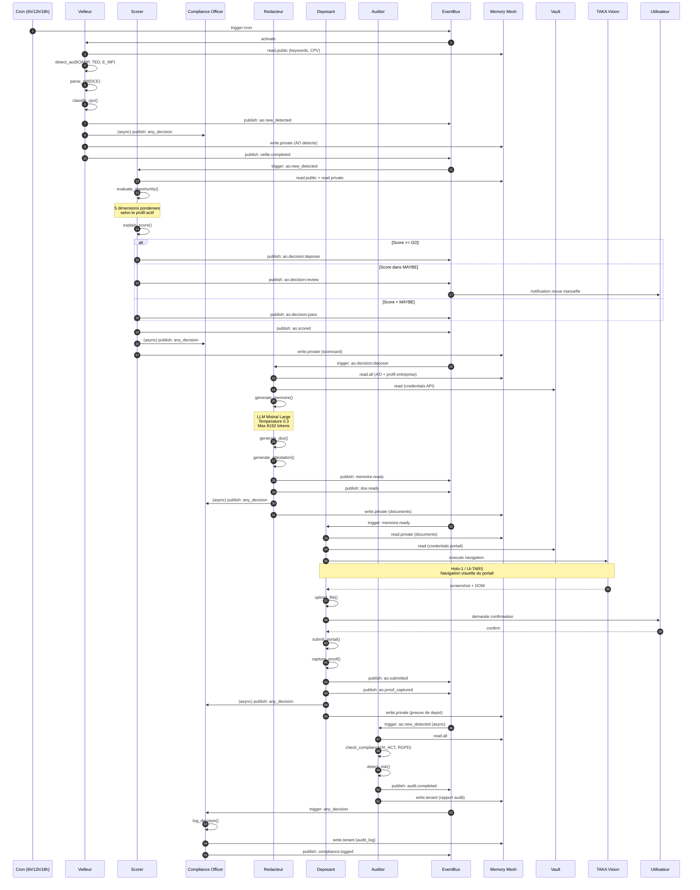

# TAKA OS — Manifeste Vertical Appels d'Offres v1.0.0

```
================================================================================
 TAKA OS — Vertical AO v1.0.0
 Manifeste declaratif complet | Swarm Agentic Architecture
 License: MIT | Format: TAKA Swarm Manifest v1.0
================================================================================
```

---

## Table des matieres

1. [Vue d'ensemble du Vertical AO](#section-1--vue-densemble-du-vertical-ao)
2. [Manifest YAML Complet](#section-2--manifest-yaml-complet)
3. [Diagramme de Sequence Complet](#section-3--diagramme-de-sequence-complet)
4. [Matrice de Permissions](#section-4--matrice-de-permissions)
5. [Integration Ecosysteme](#section-5--integration-ecosysteme)
6. [Phasing d'Implementation](#section-6--phasing-dimplementation)

---

## SECTION 1 — Vue d'ensemble du Vertical AO

### 1.1 Mission

> **Automatiser le cycle complet de vie d'un Appel d'Offres — de la detection au depot.**

Le Vertical Appels d'Offres de TAKA OS est un ecosysteme agentique declaratif qui couvre l'integralite du pipeline de reponse aux marches publics en France, Belgique et Maroc. Il transforme un processus manuel fragmente (15-40 heures par AO) en un workflow agentique orchestré, mesurable et conforme.

### 1.2 Architecture du Vertical

Le vertical s'appuie sur le **TAKA OS Kernel** (EventBus asyncio → NATS en v1.0) et s'integre dans le **Swarm Registry v0.5+** avec un acces a la **Memory Mesh 3 zones** (public, private, tenant).

```
+------------------------------------------------------------------+
|                         TAKA OS KERNEL                            |
|  +----------------+  +----------------+  +----------------------+ |
|  |  EventBus      |  |  Swarm        |  |  Memory Mesh         | |
|  |  (asyncio)     |  |  Registry     |  |  (public/private/    | |
|  |                |  |  v0.5+        |  |   tenant)            | |
|  +----------------+  +----------------+  +----------------------+ |
+------------------------------------------------------------------+
                              |
        +---------------------+---------------------+
        |                     |                     |
   +----+----+           +----+----+           +----+----+
   | VEILLEUR|           | SCORER  |           |AUDITOR  |
   | (detect)|           | (score) |           |(verify) |
   +----+----+           +----+----+           +----+----+
        |                     |                     |
        |   ao.new_detected   |   ao.scored         | audit.completed
        +-------------------->+-------------------->|
        |                     |                     |
        |              +----+----+           +----+----+
        |              |REDAC-   |           |COMPLIANCE|
        |              |TEUR     |           |OFFICER   |
        |              |(draft)  |           |(log)     |
        |              +----+----+           +----+----+
        |                     |                     |
        |   ao.decision:      |   memoire.ready     | any_decision
        |   deposer           +-------------------->|
        |                     |                     |
        |              +----+----+                  |
        |              |DEPOSANT |                  |
        |              |(submit) |                  |
        |              +----+----+                  |
        |                     |                     |
        |              ao.submitted                 |
        |              ao.proof_captured            |
        +--------------------+----------------------+
                              |
                    +---------+---------+
                    |  POSTGRES +       |
                    |  pgvector           |
                    |  (persistence)      |
                    +---------------------+
```

### 1.3 Les 6 Agents

| # | Agent | Role | Statut | Time max |
|---|-------|------|--------|----------|
| 1 | **Veilleur** | Detection et parsing des AO sur portails publics | stable | 5 min |
| 2 | **Scorer** | Evaluation multi-criteres et decision GO/NO-GO/MAYBE | stable | 2 min |
| 3 | **Redacteur** | Generation memoire technique, DCE, attestations | stable | 10 min |
| 4 | **Deposant** | Depot automatise sur portails acheteurs (Holo-1) | beta | 5 min |
| 5 | **Auditor** | Verification conformite AI Act, RGPD, marches publics | stable | 3 min |
| 6 | **Compliance Officer** | Tracabilite decisions, transparence, droits utilisateurs | stable | 2 min |

### 1.4 Profils de Scoring

Le systeme de scoring repose sur **5 dimensions** ponderees selon le profil strategique de l'entreprise:

#### Dimension 1: Coherence Metier
Alignement entre le contenu de l'AO et le coeur de metier de l'entreprise. Analyse par LLM (Mistral) + matching de keywords + historique de projets similaires.

#### Dimension 2: Viabilite Financiere
Capacite financiere de l'entreprise a realiser le marche. Ratio CA/montant AO, tresorerie disponible, capacite d'endettement. Source: Chift / comptabilite integree.

#### Dimension 3: Accessibilite Geographique
Proximite geographique entre le lieu d'execution et les antennes de l'entreprise. Distance en km, couts de deplacement estimes, presence locale.

#### Dimension 4: Faisabilite Temporelle
Capacite a respecter les delais. Date limite de depot, duree d'execution, charge de travail actuelle, disponibilite des ressources.

#### Dimension 5: Intelligence Concurrentielle
Analyse du niveau de concurrence attendu. Nombre de candidats historiques, taux de succes du client, specificite technique (barriere a l'entree).

### 1.5 Profils Disponibles

```
+----------------+----------------+----------------+----------------+
| Critere        | Profil Prudent | Profil Spec.   | Profil Oppor.  |
+----------------+----------------+----------------+----------------+
| Seuil GO       | >= 0.80        | >= 0.75        | >= 0.55        |
| Seuil MAYBE    | 0.60 - 0.79    | 0.45 - 0.74    | 0.35 - 0.54    |
| Seuil NO-GO    | < 0.60         | < 0.45         | < 0.35         |
+----------------+----------------+----------------+----------------+
| Coherence      | 30%            | 40%            | 15%            |
| Financier      | 25%            | 20%            | 20%            |
| Geographique   | 15%            | 10%            | 15%            |
| Temporel       | 20%            | 15%            | 20%            |
| Concurrentiel  | 10%            | 15%            | 30%            |
+----------------+----------------+----------------+----------------+
```

### 1.6 Flux de donnees entre agents

```
Cron(6h) --[trigger]--> Veilleur --[ao.new_detected]--> Scorer
                                                          |
                                    +---------------------+---------------------+
                                    | score >= 0.80 (GO)  | 0.60-0.79 (MAYBE)  |
                                    v                     v                     |
                           ao.decision:deposer    ao.decision:review          |
                                    |                     |                     |
                                    v                     v                     |
                              Redacteur               Humain (UI)               |
                                    |                                           |
                           memoire.ready                                        |
                                    |                                           |
                                    v                                           |
                               Deposant                                         |
                                    |                                           |
                           ao.submitted                                         |
                           ao.proof_captured                                    |
                                    |                                           |
                                    v                                           |
                           [Archive / CRM]                                      |
                                    |                                           |
                                    v                                           |
                           Compliance Officer <---------------------------------+
                           (log de toutes les decisions)
                                    |
                                    v
                           [Audit Logs PostgreSQL]
```

---

## SECTION 2 — Manifest YAML Complet

Le manifeste YAML declaratif complet est disponible dans le fichier accompagnant ce document:

**Fichier**: `config/vertical_ao_v1.yaml`

### 2.1 Structure du YAML

Le fichier definit:

- **`vertical_id`**: `taka-ao-v1` — identifiant unique du vertical
- **`agents`**: 6 agents avec capabilities, triggers, permissions, lifecycle et config
- **`scoring_profiles`**: 3 profils (prudent, opportuniste, specialise) avec 5 dimensions
- **`event_flow`**: 11 regles d'orchestration par events
- **`pipeline_states`**: 9 etats du pipeline AO
- **`config`**: Configuration globale (kernel, memory, llm, security, integrations)

### 2.2 Detail des agents dans le YAML

#### Agent Veilleur (`agent_id: veilleur`)

| Capability | Input | Output | Description |
|------------|-------|--------|-------------|
| `detect_ao` | portal, keywords, cpv_codes, min/max_amount, regions | ao_id, title, description, cpv_code, estimated_amount, deadline, buyer_name, confidence_score | Detection sur 5 portails (BOAMP, TED, E_MP, ATTRACTIVITE, MARCHESPUBLICS) |
| `parse_pdf` | file_path, file_type, extraction_level | raw_text, tables, metadata, sections_detected, pages | Parsing PDF avec OCR, extraction de tableaux |
| `classify_cpv` | ao_text, cpv_hint | cpv_primary, cpv_secondary, sector, confidence | Classification automatique par code CPV |

**Triggers**: cron (6h/12h/18h), event user.request_veille, event webhook.new_ao

**Permissions**: memory read.public/write.private, bus publish/subscribe, external APIs BOAMP/TED/E_MP

#### Agent Scorer (`agent_id: scorer`)

| Capability | Input | Output | Description |
|------------|-------|--------|-------------|
| `evaluate_opportunity` | ao_id, company_profile_id, scoring_profile | global_score (0-1), decision (GO/NO-GO/MAYBE), 5 dimensions detaillees | Scoring multi-criteres avec LLM |
| `explain_score` | scoring_result, language, detail_level | summary, detailed_explanation, key_factors | Explication humaine du score |
| `compare_opportunities` | ao_ids[], company_profile_id | comparisons[], best_choice, trade_off_analysis | Comparaison multi-AO |

**Triggers**: event ao.new_detected (si confidence >= 0.7), event user.request_score

**Permissions**: memory read.public/read.private/write.private, bus publish/subscribe, llm_api mistral.large, scoring_engine execute

#### Agent Redacteur (`agent_id: redacteur`)

| Capability | Input | Output | Description |
|------------|-------|--------|-------------|
| `generate_memoire` | ao_id, company_profile_id, dce_text, tone, max_pages | memoire_id, sections[], full_text, quality_score, compliance_check | Memoire technique par LLM |
| `generate_dce` | ao_id, company_profile_id, pricing_strategy, documents_required | dce_id, documents[], financial_offer, ready_for_signature | Offre financiere + DC1/DC2 |
| `generate_attestation` | attestation_type, company_profile_id | attestation_id, content, status | Attestations fiscale/sociale/assurance |

**Triggers**: event ao.decision:deposer, event user.request_redaction

**Permissions**: memory read.all/write.private, bus publish/subscribe, llm_api mistral.large, vault read

#### Agent Deposant (`agent_id: deposant`)

| Capability | Input | Output | Description |
|------------|-------|--------|-------------|
| `submit_portal` | ao_id, portal_type, credentials_key, documents[] | submission_id, status, portal_reference, screenshot_proof | Depot automatise via Holo-1 |
| `upload_file` | portal_type, credentials_key, file_path | upload_id, status, portal_file_id | Upload individuel de fichiers |
| `capture_proof` | ao_id, submission_id, proof_type | proof_id, file_path, integrity_hash | Preuve de depot (screenshot) |

**Triggers**: event memoire.ready, event dce.ready, event user.request_depo

**Permissions**: memory read/write private, vault read, holo1 execute, bus publish/subscribe

**Human-in-the-loop**: Confirmation obligatoire avant depot (configurable)

#### Agent Auditor (`agent_id: auditor`)

| Capability | Input | Output | Description |
|------------|-------|--------|-------------|
| `check_compliance` | target_type, target_id, frameworks[], depth | audit_id, overall_status, findings[], risk_score | Conformite AI Act / RGPD / Marches publics |
| `generate_audit_report` | audit_id, format, include_recommendations | report_id, content, file_path | Rapport d'audit complet |
| `detect_risk` | target_type, target_id, risk_categories[] | risk_assessment_id, risks[], overall_risk_level | Detection de risques reglementaires |

**Triggers**: event ao.new_detected (async), cron hebdomadaire, event decision.chain_complete

**Permissions**: memory read.all (public/private/tenant), bus publish/subscribe

#### Agent Compliance Officer (`agent_id: compliance_officer`)

| Capability | Input | Output | Description |
|------------|-------|--------|-------------|
| `log_decision` | decision_type, decision_id, agent_id, ao_id, confidence_score | log_id, integrity_hash, retention_until | Tracabilite AI Act Art. 12 |
| `generate_transparency_report` | period_start, period_end, format | report_id, decisions_count, human_overrides_count | Rapport de transparence AI Act Art. 52 |
| `handle_user_request` | request_type, user_id, scope | request_reference, status, estimated_completion_days | Demandes RGPD (acces, rectification, effacement) |
| `explain_decision` | decision_id, user_language, detail_level | explanation_id, explanation, factors[], user_rights | Droit a l'explication |

**Triggers**: event any_decision, event user.request_data, event user.request_explanation, cron mensuel

**Permissions**: memory read.all + write.tenant, bus publish/subscribe, vault read

### 2.3 Event Flow detaille

| # | Trigger | Agent | Condition | Action | Event produit |
|---|---------|-------|-----------|--------|---------------|
| 1 | cron 6h | Veilleur | — | Polling portails | `ao.new_detected` |
| 2 | `ao.new_detected` | Scorer | confidence >= 0.7 | Scoring 5D | `ao.scored` |
| 3 | `ao.scored` | Pipeline | score >= seuil GO | Move in_preparation | `ao.decision:deposer` |
| 4 | `ao.scored` | Pipeline | MAYBE zone | Move in_review | `ao.decision:review` |
| 5 | `ao.scored` | Pipeline | score < seuil MAYBE | Archivage | `ao.decision:pass` |
| 6 | `ao.decision:deposer` | Redacteur | — | Generation documents | `memoire.ready`, `dce.ready` |
| 7 | `memoire.ready` | Deposant | confirm_before_submit | Depot + preuve | `ao.submitted`, `ao.proof_captured` |
| 8 | `any_decision` | Compliance | — | Logging tracabilite | `compliance.logged` |
| 9 | `ao.new_detected` | Auditor | async = true | Audit conformite | `audit.completed` |
| 10 | cron hebdo | Auditor | — | Audit complet | `audit.weekly_report` |
| 11 | cron mensuel | Compliance | — | Transparence | `compliance.monthly_report` |

---

## SECTION 3 — Diagramme de Sequence Complet

### 3.1 Diagramme Mermaid



### 3.2 Diagramme ASCII (version simplifiee)

```
    Cron(6h)
       |
       | trigger:cron
       v
   +--------+     detect_ao()      +--------+
   |VEILLEUR|--------------------->| Portails|
   |        |     parse_pdf()      | BOAMP   |
   |        |--------------------->| TED     |
   |        |     classify_cpv()   | E_MP    |
   +---+----+                      +---------+
       |
       | publish: ao.new_detected
       v
   +--------+     evaluate_opportunity()   +--------+
   | SCORER |----------------------------->| Mistral |
   |        |     explain_score()          | LLM     |
   |        |<-----------------------------|         |
   +---+----+                              +---------+
       |
       | if score >= GO threshold
       | publish: ao.decision:deposer
       v
   +--------+     generate_memoire()      +--------+
   |REDAC-  |---------------------------->| Mistral |
   |TEUR    |     generate_dce()           | Large  |
   |        |     generate_attestation()   |        |
   +---+----+                              +---------+
       |
       | publish: memoire.ready
       v
   +--------+     submit_portal()          +-----------+
   |DEPOSANT|----------------------------->| Holo-1    |
   |        |     upload_file()            | Ui-TARS   |
   |        |     capture_proof()          | (vision)  |
   +---+----+                              +-----------+
       |
       | publish: ao.submitted
       | publish: ao.proof_captured
       v
   [ARCHIVE + CRM SYNC]

   =============================================
   PROCESSUS ASYNCHRONES (tout au long du flux)
   =============================================

   +---------+     check_compliance()         +--------+
   | AUDITOR |-------------------------------->| AI Act |
   |         |     detect_risk()              | RGPD   |
   | (async) |     generate_audit_report()    | M.Pub. |
   +---------+                                +--------+

   +-----------------+     log_decision()            +----------+
   | COMPLIANCE      |-------------------------------->| PostgreSQL|
   | OFFICER         |     generate_transparency()     | audit_logs|
   | (tout event)    |     handle_user_request()       |           |
   +-----------------+                                 +----------+
```

### 3.3 Diagramme d'etat (Pipeline AO)

```
                    +-----------+
         +--------->| DETECTED  |<----------+
         |          | (gris)    |           |
         |          +-----+-----+           |
         |                | ao.scored      |
         |                v                |
         |          +-----------+          |
         |   +----->|  SCORED   |<-----+   |
         |   |      | (bleu)    |      |   |
         |   |      +-----+-----+      |   |
         |   |            |            |   |
         |   |   +--------+ +--------+  |   |
         |   |   | MAYBE   |   GO      |   |
         |   |   v         v          v    |
         |   | +-----------+  +-------------+
         |   | | IN_REVIEW |  |IN_PREPARATION|
         |   | |(orange)   |  | (violet)    |
         |   | +-----+-----+  +------+------+
         |   |       | human        |
         |   |       v              v
         |   |  [REJECTED]    +-------------+
         |   |                |  DRAFTING   |
         |   |                |  (rose)     |
         |   |                +------+------+
         |   |                       |
         |   |                       v
         |   |                +-------------+
         |   |                |READY_TO_SUB |
         |   |                | (vert)      |
         |   |                +------+------+
         |   |                       |
         |   |                       | confirm
         |   |                       v
         |   |                +-------------+
         |   |                |  SUBMITTED  |
         |   |                | (vert fonce)|
         |   |                +------+------+
         |   |                       |
         |   |                       v
         |   |                +-------------+
         |   |                |  ARCHIVED   |
         |   |                | (gris)      |
         |   |                +-------------+
         |   |
         |   +---- score < MAYBE threshold
         |   |
         |   v
         | +-----------+
         | |  ARCHIVED |
         | |  (NO-GO)  |
         | +-----------+
         |
         +---- retry on error
         |
         v
    +-----------+
    |   ERROR   |
    |  (rouge)  |
    +-----+-----+
          |
          +---- retry (max 3)
          |
          v
    [back to previous state]
```

---


## SECTION 4 — Matrice de Permissions

### 4.1 Matrice Agent x Ressource x Permission

La matrice suivante definit les droits granulaires de chaque agent sur chaque ressource systeme.

**Legende**:
- `R` = Read (lecture)
- `W` = Write (ecriture)
- `X` = Execute (execution)
- `-` = Aucun acces
- `R/W` = Read + Write
- `R/X` = Read + Execute

#### Tableau principal

| Agent | memory.public | memory.private | memory.tenant | bus.publish | bus.subscribe | llm.api | scoring.engine | vault.read | vault.write | holo1.execute | external_apis |
|-------|:-------------:|:--------------:|:-------------:|:-----------:|:-------------:|:-------:|:--------------:|:----------:|:-----------:|:-------------:|:-------------:|
| **Veilleur** | R | W | - | X | X | - | - | - | - | - | X (BOAMP, TED, E_MP) |
| **Scorer** | R | R/W | - | X | X | X (Mistral L/M) | X | - | - | - | X (Chift, Mistral) |
| **Redacteur** | R | R/W | - | X | X | X (Mistral L) | - | R | - | - | X (Mistral, Chift, Yousign) |
| **Deposant** | - | R/W | - | X | X | - | - | R | - | X | X (Portails, Yousign, Docusign) |
| **Auditor** | R | R | R | X | X | - | - | - | - | - | X (PostgreSQL audit, RGPD) |
| **Compliance** | R | R | R/W | X | X | - | - | R | - | - | X (PostgreSQL, RGPD) |

#### Tableau detaille par ressource

```
RESSOURCE: memory.public (Zone publique - referentiels, CPV, reglementation)
+-----------+------+-------+-------------------------------------------+
| Agent     | Read | Write | Usage                                     |
+-----------+------+-------+-------------------------------------------+
| Veilleur  |  X   |   -   | Lecture keywords, CPV, config portails    |
| Scorer    |  X   |   -   | Lecture referentiels scoring, historique  |
| Redacteur |  X   |   -   | Lecture templates, exemples, references   |
| Deposant  |  -   |   -   | Pas d'acces necessaire                    |
| Auditor   |  X   |   -   | Lecture referentiels conformite           |
| Compliance|  X   |   -   | Lecture reglementation, decisions passees |
+-----------+------+-------+-------------------------------------------+

RESSOURCE: memory.private (Zone privee - donnees AO, documents, scores)
+-----------+------+-------+-------------------------------------------+
| Agent     | Read | Write | Usage                                     |
+-----------+------+-------+-------------------------------------------+
| Veilleur  |  -   |   X   | Ecriture AO detectes, metadonnees brutes  |
| Scorer    |  X   |   X   | Lecture AO, ecriture scorecards           |
| Redacteur |  X   |   X   | Lecture AO + score, ecriture documents    |
| Deposant  |  X   |   X   | Lecture documents, ecriture preuves       |
| Auditor   |  X   |   -   | Lecture documents pour audit              |
| Compliance|  X   |   -   | Lecture decisions pour tracabilite        |
+-----------+------+-------+-------------------------------------------+

RESSOURCE: memory.tenant (Zone tenant - logs audit, rapports conformite)
+-----------+------+-------+-------------------------------------------+
| Agent     | Read | Write | Usage                                     |
+-----------+------+-------+-------------------------------------------+
| Veilleur  |  -   |   -   | Pas d'acces                               |
| Scorer    |  -   |   -   | Pas d'acces                               |
| Redacteur |  -   |   -   | Pas d'acces                               |
| Deposant  |  -   |   -   | Pas d'acces                               |
| Auditor   |  X   |   X   | Lecture/ecriture rapports d'audit         |
| Compliance|  X   |   X   | Lecture/ecriture logs de tracabilite      |
+-----------+------+-------+-------------------------------------------+

RESSOURCE: bus.publish + bus.subscribe (EventBus kernel)
+-----------+---------+-----------+-------------------------------------------+
| Agent     | Publish | Subscribe | Events cles                             |
+-----------+---------+-----------+-------------------------------------------+
| Veilleur  |    X    |     X     | P: ao.new_detected, veille.completed    |
|           |         |           | S: cron, user.request_veille, retry     |
| Scorer    |    X    |     X     | P: ao.scored, ao.decision:*             |
|           |         |           | S: ao.new_detected, user.request_score  |
| Redacteur |    X    |     X     | P: memoire.ready, dce.ready             |
|           |         |           | S: ao.decision:deposer, retry           |
| Deposant  |    X    |     X     | P: ao.submitted, ao.proof_captured      |
|           |         |           | S: memoire.ready, user.request_depo     |
| Auditor   |    X    |     X     | P: audit.completed, audit.weekly_report |
|           |         |           | S: ao.new_detected, cron hebdo          |
| Compliance|    X    |     X     | P: compliance.logged, monthly_report    |
|           |         |           | S: any_decision, user.request_*         |
+-----------+---------+-----------+-------------------------------------------+

RESSOURCE: llm.api (Mistral AI - acces aux modeles de langage)
+-----------+------------------+-------------------------------------------+
| Agent     | Modeles autorises | Usage                                     |
+-----------+------------------+-------------------------------------------+
| Veilleur  | -                | Pas d'acces direct LLM                    |
| Scorer    | mistral.large    | Analyse coherence metier, explication     |
|           | mistral.medium   | Score de base, matching                   |
| Redacteur | mistral.large    | Generation memoire, DCE, attestations     |
| Deposant  | -                | Pas d'acces LLM                           |
| Auditor   | -                | Audit base sur regles, pas de generation  |
| Compliance| -                | Logging structure, pas de generation      |
+-----------+------------------+-------------------------------------------+

RESSOURCE: vault.read (Acces aux secrets et credentials)
+-----------+------+-------------------------------------------+
| Agent     | Read | Usage                                     |
+-----------+------+-------------------------------------------+
| Veilleur  |  -   | Pas d'acces Vault                         |
| Scorer    |  -   | Pas d'acces Vault                         |
| Redacteur |  X   | Lecture credentials CRM, API externes     |
| Deposant  |  X   | Lecture credentials portails AO           |
| Auditor   |  -   | Pas d'acces Vault                         |
| Compliance|  X   | Lecture cles pour logs chiffres           |
+-----------+------+-------------------------------------------+

RESSOURCE: holo1.execute (TAKA Vision - navigation visuelle)
+-----------+---------+-------------------------------------------+
| Agent     | Execute | Usage                                     |
+-----------+---------+-------------------------------------------+
| Veilleur  |    -    | Pas d'acces Vision                        |
| Scorer    |    -    | Pas d'acces Vision                        |
| Redacteur |    -    | Pas d'acces Vision                        |
| Deposant  |    X    | Navigation portails, upload, depot        |
| Auditor   |    -    | Pas d'acces Vision                        |
| Compliance|    -    | Pas d'acces Vision                        |
+-----------+---------+-------------------------------------------+
```

### 4.2 Regles de securite transverses

1. **Separation des privileges**: Aucun agent n'a acces simultane a `vault.write` et `holo1.execute` (principe de moindre privilege)
2. **Audit immuable**: Les logs du Compliance Officer sont en write-only append (pas de modification possible)
3. **Human-in-the-loop**: Le Deposant requiert une validation humaine avant tout depot effectif
4. **Chiffrement**: Toutes les donnees en `memory.private` et `memory.tenant` sont chiffrees au repos (AES-256)
5. **Retention**: Les donnees `memory.tenant` (audit) sont conservees 7 ans (exigence reglementaire francaise)

---

## SECTION 5 — Integration Ecosysteme

Chaque agent consomme des connecteurs externes specifiques. Le tableau ci-dessous detaille les integrations par agent et fournisseur.

### 5.1 Veilleur — Connecteurs de Detection

```
+------------------+-----------+----------+---------+---------------------------+
| Connecteur       | Type      | Auth     | Statut  | Usage                     |
+------------------+-----------+----------+---------+---------------------------+
| BOAMP API v2     | REST      | None     | Actif   | Marches publics francais  |
| TED API v2       | REST      | API Key  | Actif   | JOUE / marches europeens  |
| E-MP Scraper     | Web       | Basic    | Actif   | e-marchespublics.com      |
| Attractivite     | REST      | TBD      | Planif. | marches-publics.gouv.fr   |
| MarchesPublics   | REST      | TBD      | Planif. | marchespublics.com        |
| Chift API        | REST      | OAuth2   | Actif   | Enrichissement acheteur   |
+------------------+-----------+----------+---------+---------------------------+
```

**Configuration reseau**:
- Rate limiting configurable par portail (1 req / 2-10s)
- Timeouts: 30-60s selon le portail
- Retry automatique avec backoff exponentiel (3 tentatives max)
- Parsing PDF: OCR Tesseract (fra) + extraction tableaux Camelot/Tabula

### 5.2 Scorer — Connecteurs d'Analyse

```
+------------------+-----------+----------+---------+---------------------------+
| Connecteur       | Type      | Auth     | Statut  | Usage                     |
+------------------+-----------+----------+---------+---------------------------+
| Mistral AI API   | REST/SSE  | API Key  | Actif   | Analyse LLM, scoring      |
| Chift API        | REST      | OAuth2   | Actif   | Donnees financieres (CA)  |
| Memory Mesh      | Internal  | Kernel   | Actif   | Historique, references    |
| Scoring Engine   | Internal  | Kernel   | Actif   | Calcul ponderation 5D     |
+------------------+-----------+----------+---------+---------------------------+
```

**Details scoring**:
- Model: `mistral-large-latest`, temperature 0.2 (deterministe)
- Caching: TTL 1h par combinaison (ao_id, profile_id)
- Source financiere: Chift (compta) → ratio CA / montant AO
- Source geographique: Geocodage + calcul distance
- Source concurrentielle: Historique des resultats dans Memory Mesh

### 5.3 Redacteur — Connecteurs de Generation

```
+------------------+-----------+----------+---------+---------------------------+
| Connecteur       | Type      | Auth     | Statut  | Usage                     |
+------------------+-----------+----------+---------+---------------------------+
| Mistral AI API   | REST/SSE  | API Key  | Actif   | Generation documents      |
|                  |           |          |         | Max tokens: 8192          |
|                  |           |          |         | Streaming: active         |
| Chift API        | REST      | OAuth2   | Actif   | Donnees entreprise (ref.) |
| Yousign API      | REST      | API Key  | Actif   | Signature electronique    |
| Dougs API        | REST      | OAuth2   | Actif   | Donnees comptables        |
| Vault            | Internal  | Kernel   | Actif   | Credentials API externes  |
| CRM Connectors   | REST      | OAuth2   | Actif   | References projets        |
|   - HubSpot      |           |          |         |                           |
|   - Pipedrive    |           |          |         |                           |
|   - Salesforce   |           |          |         |                           |
|   - Dynamics     |           |          |         |                           |
|   - Odoo         |           |          |         |                           |
+------------------+-----------+----------+---------+---------------------------+
```

**Generation memoire technique**:
- Template base: `templates/memoire_technique_base.md`
- Sections obligatoires: Presentation, Methodologie, Moyens, References, Planning, Garanties
- Qualite minimale: score >= 0.75 (auto-retry si inferieur)
- Formats de sortie: DOCX (defaut), PDF, ODT

### 5.4 Deposant — Connecteurs de Depot

```
+------------------+-----------+----------+---------+---------------------------+
| Connecteur       | Type      | Auth     | Statut  | Usage                     |
+------------------+-----------+----------+---------+---------------------------+
| TAKA Vision      | Internal  | Holo-1   | Beta    | Navigation visuelle       |
|   Holo-1         |           | v1.2+    |         | Model: ui-tars-7b-dpo     |
|   Ui-TARS        |           |          |         | Browser: Chromium headless|
| BOAMP Portal     | Web       | Vault    | Actif   | Depot candidature         |
| E-MP Portal      | Web       | Vault    | Actif   | Depot candidature         |
| Yousign API      | REST      | API Key  | Actif   | Signature electronique    |
| DocuSign API     | REST      | OAuth2   | Planif. | Signature (alternative)   |
| Vault            | Internal  | Kernel   | Actif   | Credentials portails      |
+------------------+-----------+----------+---------+---------------------------+
```

**Configuration TAKA Vision**:
- Viewport: 1920x1080
- User-agent: `TAKA-OS-Bot/1.0`
- Delai entre actions: 500ms
- Qualite screenshot: haute
- Capture de preuve: screenshot + PDF + hash SHA-256

### 5.5 Auditor — Connecteurs de Conformite

```
+------------------+-----------+----------+---------+---------------------------+
| Connecteur       | Type      | Auth     | Statut  | Usage                     |
+------------------+-----------+----------+---------+---------------------------+
| PostgreSQL       | SQL       | Internal | Actif   | Stockage rapports audit   |
|   + pgvector     |           |          |         | Embeddings conformite     |
| RGPD Registry    | Internal  | Kernel   | Actif   | Registre traitements DCP  |
| AI Act Base      | Internal  | Kernel   | Actif   | Referentiel reglementaire |
| Memory Mesh      | Internal  | Kernel   | Actif   | Lecture donnees audit     |
+------------------+-----------+----------+---------+---------------------------+
```

**Referentiels d'audit**:
- AI Act 2024/1689 (risk level: high, articles 50/52/53/55/56)
- RGPD 2016/679 (DPO: dpo@takaos.io, retention: 5 ans)
- Code de la commande publique (seuils: EUR 215K / 90K / 40K)

### 5.6 Compliance Officer — Connecteurs de Tracabilite

```
+------------------+-----------+----------+---------+---------------------------+
| Connecteur       | Type      | Auth     | Statut  | Usage                     |
+------------------+-----------+----------+---------+---------------------------+
| PostgreSQL       | SQL       | Internal | Actif   | audit_logs (append-only)  |
|   audit_logs     |           |          |         | Table partitionnee        |
| Vault            | Internal  | Kernel   | Actif   | Cles pour logs chiffres   |
| EventBus         | Internal  | Kernel   | Actif   | Souscription any_decision |
| RGPD Registry    | Internal  | Kernel   | Actif   | Traitement demandes DSR   |
+------------------+-----------+----------+---------+---------------------------+
```

**Specifications de tracabilite**:
- Hash SHA-256 par decision (integrite verifiable)
- Logs append-only (pas de suppression possible)
- Retention: 7 ans (2555 jours)
- Rapport mensuel: 1er de chaque mois a 00:00
- Droit a l'explication: reponse sous 30 jours

---

## SECTION 6 — Phasing d'Implementation

### 6.1 Roadmap des versions

| Version | Date cible | Agents disponibles | Nouveaute cle |
|---------|------------|-------------------|---------------|
| **v0.1** | Q1 2025 | Veilleur (upload manuel), Scorer (regles) | 2 agents codes en dur, scoring base sur regles |
| **v0.2** | Q1 2025 | + Veilleur (connecteurs API) | Polling automatique BOAMP/TED/E-MP, parsing PDF |
| **v0.3** | Q2 2025 | + Auditor | Conformite AI Act, audits automatiques, rapports |
| **v0.5** | Q2 2025 | + Redacteur (template) | Generation memoire technique par templates + LLM |
| **v1.0** | Q3 2025 | + Compliance Officer | Tracabilite complete, transparence, droits RGPD |
| **v1.2** | Q3 2025 | + Deposant (TAKA Vision) | Depot automatise via Holo-1/Ui-TARS |

### 6.2 Detail par version

#### v0.1 — MVP Fondation (Q1 2025)

```
Agents:     [Veilleur][Scorer]
Statut:     Code en dur, 2 agents
Features:
  - Veilleur: Upload manuel de fichiers PDF/zip + parsing basique
  - Scorer: Regles statiques (pas de LLM), 3 profils en dur
  - Output: Score simple + decision binaire
  - Pas d'EventBus — appels directs Python
Integrations:
  - Aucune API externe (upload manuel uniquement)
Limites:
  - Pas de polling automatique
  - Scoring non contextualise
  - Pas de generation de documents
```

#### v0.2 — Veille Connectee (Q1 2025)

```
Agents:     [Veilleur (maj)][Scorer]
Statut:     Connecteurs API actifs
Features:
  - Veilleur: Polling automatique BOAMP + TED + E-MP
  - Veilleur: Parsing PDF avance (OCR + tableaux)
  - Veilleur: Classification CPV automatique
  - EventBus asyncio en place
  - Premier connecteur: Chift (enrichissement)
Integrations:
  + BOAMP API v2
  + TED API v2
  + E-MP Scraper
  + Chift API (enrichissement)
Limites:
  - Scoring toujours base sur regles
  - Pas encore de generation
```

#### v0.3 — Conformite (Q2 2025)

```
Agents:     [Veilleur][Scorer][Auditor]
Statut:     Audit actif
Features:
  + Auditor: check_compliance() sur AI Act + RGPD
  + Auditor: detect_risk() avec categories
  + Auditor: generate_audit_report()
  + Audits asynchrones sur chaque nouvel AO
  + Rapport hebdomadaire automatique
Integrations:
  + PostgreSQL audit_logs
  + RGPD Registry
Limites:
  - Pas de generation de documents
  - Pas de depot automatise
```

#### v0.5 — Redaction Intelligente (Q2 2025)

```
Agents:     [Veilleur][Scorer][Auditor][Redacteur]
Statut:     Generation active
Features:
  + Redacteur: generate_memoire() via Mistral Large
  + Redacteur: generate_dce() (DC1, DC2, offre financiere)
  + Redacteur: generate_attestation() (fiscale, sociale)
  + Templates parametrables
  + Scoring par LLM (Mistral) pour le Scorer
  + Systeme de caching
Integrations:
  + Mistral AI API
  + Yousign API (signature)
  + CRM connectors (HubSpot, Pipedrive, Salesforce, Dynamics, Odoo)
  + Dougs API (comptabilite)
Limites:
  - Depot manuel (documents generes a deposer)
  - Pas de tracabilite complete
```

#### v1.0 — Tracabilite Complete (Q3 2025)

```
Agents:     [Veilleur][Scorer][Auditor][Redacteur][Compliance Officer]
Statut:     Conformite AI Act niveau 3
Features:
  + Compliance Officer: log_decision() avec hash d'integrite
  + Compliance Officer: generate_transparency_report()
  + Compliance Officer: handle_user_request() (RGPD DSR)
  + Compliance Officer: explain_decision() (droit a l'explication)
  + Rapport mensuel automatique
  + Logs immuables (append-only)
  + NATS EventBus (remplace asyncio)
Integrations:
  + PostgreSQL partitionne (audit)
  + Vault (gestion des cles)
Limites:
  - Depot semi-automatise (encore manuel)
```

#### v1.2 — Depot Autonome (Q3 2025)

```
Agents:     [Tous les 6 agents]
Statut:     Vertical complet
Features:
  + Deposant: submit_portal() via TAKA Vision Holo-1
  + Deposant: upload_file() automatise
  + Deposant: capture_proof() (screenshot + hash)
  + Human-in-the-loop configurable
  + Navigation visuelle Ui-TARS
  + Pipeline end-to-end entierement automatise
Integrations:
  + TAKA Vision v1.2+ (Holo-1 / Ui-TARS)
  + BOAMP Portal connector
  + E-MP Portal connector
  + DocuSign API (alternative signature)
```

### 6.3 Matrice de disponibilite des features par version

```
Feature                    | v0.1 | v0.2 | v0.3 | v0.5 | v1.0 | v1.2 |
---------------------------|------|------|------|------|------|------|
Detection manuelle (PDF)   |  X   |  X   |  X   |  X   |  X   |  X   |
Polling automatique        |      |  X   |  X   |  X   |  X   |  X   |
Parsing PDF (OCR)          |  X   |  X   |  X   |  X   |  X   |  X   |
Classification CPV         |      |  X   |  X   |  X   |  X   |  X   |
Scoring regles             |  X   |  X   |  X   |      |      |      |
Scoring LLM                |      |      |      |  X   |  X   |  X   |
Explication scoring        |      |      |      |  X   |  X   |  X   |
Audit conformite           |      |      |  X   |  X   |  X   |  X   |
Generation memoire         |      |      |      |  X   |  X   |  X   |
Generation DCE             |      |      |      |  X   |  X   |  X   |
Attestations               |      |      |      |  X   |  X   |  X   |
Tracabilite decisions      |      |      |      |      |  X   |  X   |
Transparence AI Act        |      |      |      |      |  X   |  X   |
Droit a l'explication      |      |      |      |      |  X   |  X   |
Depot automatise (Holo-1)  |      |      |      |      |      |  X   |
Preuve de depot            |      |      |      |      |      |  X   |
CRM sync                   |      |      |      |  X   |  X   |  X   |
Signature electronique     |      |      |      |  X   |  X   |  X   |
EventBus asyncio           |      |  X   |  X   |  X   |  X   |      |
EventBus NATS              |      |      |      |      |  X   |  X   |
Human-in-the-loop depot    |      |      |      |      |      |  X   |
```

### 6.4 Dependances externes par version

```
Version | Dependance critique          | Version min | Impact si indisponible
--------|------------------------------|-------------|---------------------------
v0.1    | Python 3.12+                 | 3.12        | Blocking
        | FastAPI                      | 0.110+      | Blocking
        | SQLAlchemy 2.0 async         | 2.0+        | Blocking
        | PostgreSQL                   | 16+         | Blocking
v0.2    | Tesseract OCR                | 5.3+        | Degraded (pas d'OCR)
        | Chift API                    | current     | Degraded (pas d'enrich.)
v0.3    | pgvector                     | 0.5+        | Blocking (pas d'embed.)
v0.5    | Mistral AI API               | current     | Blocking (pas de gen.)
        | CRM connector (1+)           | current     | Optional
v1.0    | NATS server                  | 2.10+       | Fallback asyncio
        | Vault                        | 0.8+        | Blocking (pas de securite)
v1.2    | TAKA Vision (Holo-1)         | 1.2+        | Blocking (pas de depot)
        | Ui-TARS model                | 7b-dpo      | Blocking
        | Chromium headless            | 120+        | Blocking
```

---

## Annexe A — Glossaire

| Terme | Definition |
|-------|------------|
| **AO** | Appel d'Offres — consultation publique pour attribuer un marche |
| **BOAMP** | Bulletin Officiel des Annonces des Marches Publics (France) |
| **TED** | Tenders Electronic Daily (Journal Officiel de l'UE) |
| **E-MP** | e-marchespublics.com (plateforme de dematerialisation) |
| **DCE** | Dossier de Consultation des Entreprises |
| **CPV** | Common Procurement Vocabulary — classification europeenne des marches |
| **DC1/DC2** | Declaration de candidature (formulaires standardises francais) |
| **Holo-1** | Module TAKA Vision de navigation visuelle automatisée |
| **Ui-TARS** | Model de vision pour l'automatisation d'interfaces utilisateur |
| **Memory Mesh** | Architecture de stockage multi-zones de TAKA OS |
| **EventBus** | Systeme de messagerie evenementielle du kernel |
| **AI Act** | Reglement europeen sur l'intelligence artificielle (2024/1689) |
| **DSR** | Data Subject Request — demande d'exercice de droits RGPD |
| **Human-in-the-loop** | Intervention humaine obligatoire avant action critique |

## Annexe B — Changelog

| Version | Date | Auteur | Changements |
|---------|------|--------|-------------|
| 1.0.0 | 2025-01-15 | TAKA OS Core Team | Version initiale. 6 agents, 3 profils de scoring, 11 event flows, matrice de permissions complete |

## Annexe C — References

- TAKA OS Kernel Documentation: `https://docs.takaos.io/kernel`
- TAKA Swarm Manifest Spec v1.0: `https://docs.takaos.io/swarm/manifest`
- AI Act (UE) 2024/1689: `https://eur-lex.europa.eu/eli/reg/2024/1689`
- Code de la commande publique (France): `https://www.legifrance.gouv.fr/codes/id/LEGITEXT000037701019`
- Reglement RGPD 2016/679: `https://eur-lex.europa.eu/eli/reg/2016/679`
- BOAMP API Documentation: `https://www.boamp.fr/pages/apidocumentation/`
- TED API Documentation: `https://ted.europa.eu/api dokumentation`

---

*Document genere pour TAKA OS — Vertical Appels d'Offres v1.0.0*
*License: MIT — Open Source*
